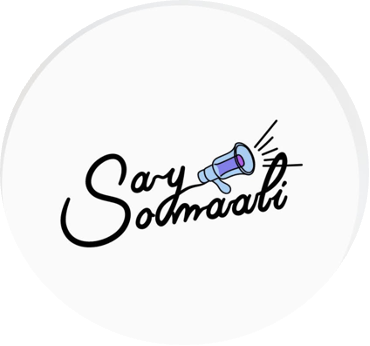

<p align="center">
  <a href="https://rahuldkjain.github.io/gh-profile-readme-generator">
    
  </a>
</p>
<h1 align="center">
  Haye-Aduunka
</h1>
<p>
This project is intended as a catalyst to spark interest in the minds of Somali adolescent. It will equip Somali youth with the knowledge and resources required to experience the world of Software development, nourishing their curiosity and replenishing their academic enthusiasm. Through a series of interactive workshops, students will be provided with the opportunity to work with development tools widely used and demonstrate skills through practical tasks.  
</p>

## 💻 Lesson Layout

<h4> 1. Participate during learning section </h4>
Instructor will walk through fundemantal concepts in HTML and CSS. 🔑 Engaing in code along can help with the task later

<h4> 2. Download Starter Code </h4>
File name follows this convention workshop-##-starter.html

<h4> 3. Replace TODO sections with your solution </h4>
Make sure to review resource list at end of workshop slides 


## 🛠️ Installation Steps

1. Clone the repository

```bash
git clone https://github.com/ibrahim681/Haye-Aduunka.git
```

2. Change the working directory

```bash
cd Haye-Aduunka
```

3. Push local changes to remote repo
```bash
git add .
git commit -m "some comment"
git push
```

🌟 You are all set!

## Resource List 
<ul>
<li> IDE https://replit.com/~ </li>
<li> IDE https://vscode.dev</li>
<li> project website https://haye-aduunka-website.vercel.app</li>
</ul>
